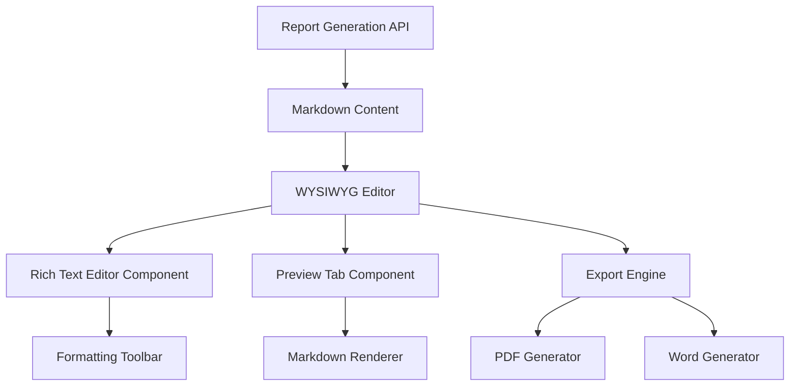

# Design Document

## Overview

The Proposal Editor Enhancement transforms the existing proposal generation site from producing raw Markdown output to delivering client-ready business documents. The system will integrate a WYSIWYG editor, professional formatting engine, and export capabilities into the existing report generation workflow.

## Architecture

### Current System Analysis

The existing system follows this flow:
1. User inputs data via forms (index.html)
2. Report generation API (api/generate.js) processes input with AI services
3. Raw Markdown content is returned and displayed in textarea
4. Basic styling is applied via styles.css

### Enhanced Architecture

The enhanced system will extend this flow:
1. User inputs data via forms (unchanged)
2. Report generation API processes input (unchanged)
3. **NEW**: Markdown content is loaded into WYSIWYG editor
4. **NEW**: Professional formatting is applied automatically
5. **NEW**: Users can edit content visually
6. **NEW**: Export functionality generates PDF/Word documents

### Component Integration Strategy



## Components and Interfaces

### 1. WYSIWYG Editor Integration

**Component**: Enhanced RichTextEditor
- **Location**: Extends existing `lib/rich-text-editor.js`
- **Integration Point**: Replace textarea in results section
- **Key Features**:
  - Markdown parsing on content load
  - Visual editing with formatting toolbar
  - Real-time preview synchronization

**Interface**:
```javascript
class ProposalEditor extends RichTextEditor {
  loadMarkdownContent(markdown: string): void
  getFormattedHTML(): string
  getMarkdown(): string
  applyBusinessStyling(): void
}
```

### 2. Professional Formatting System

**Component**: BusinessDocumentFormatter
- **Location**: New `lib/business-document-formatter.js`
- **Integration Point**: Applied to editor content and exports
- **Key Features**:
  - Standard business document CSS
  - Header/footer management
  - Template system

**Interface**:
```javascript
class BusinessDocumentFormatter {
  applyStandardStyling(content: HTMLElement): void
  setHeaderFooter(header: string, footer: string): void
  applyTemplate(templateName: string): void
  generatePrintCSS(): string
}
```

### 3. Export Engine

**Component**: DocumentExportEngine
- **Location**: New `lib/document-export-engine.js`
- **Integration Point**: Export buttons in results section
- **Key Features**:
  - PDF generation with styling preservation
  - Word document export
  - Print preview functionality

**Interface**:
```javascript
class DocumentExportEngine {
  exportToPDF(content: HTMLElement, options: ExportOptions): Promise<Blob>
  exportToWord(content: HTMLElement, options: ExportOptions): Promise<Blob>
  generatePrintPreview(content: HTMLElement): void
}
```

### 4. Enhanced Results Section

**Component**: Enhanced results display
- **Location**: Modify existing results section in `index.html`
- **Integration Point**: Replace current textarea display
- **Key Features**:
  - Tabbed interface (Edit/Preview/Split)
  - Formatting controls
  - Export buttons

## Data Models

### Document Structure
```javascript
interface ProposalDocument {
  id: string
  content: string          // HTML content
  markdown: string         // Original markdown
  metadata: {
    title: string
    author: string
    createdAt: Date
    lastModified: Date
  }
  formatting: {
    template: string
    customCSS?: string
    headerFooter: {
      header: string
      footer: string
    }
  }
  exportSettings: {
    pageSize: 'A4' | 'Letter'
    margins: MarginSettings
    includePageNumbers: boolean
  }
}
```

### Export Options
```javascript
interface ExportOptions {
  format: 'pdf' | 'docx'
  pageSize: 'A4' | 'Letter'
  margins: {
    top: number
    right: number
    bottom: number
    left: number
  }
  includeHeader: boolean
  includeFooter: boolean
  includePageNumbers: boolean
}
```

## Error Handling

### Editor Initialization Errors
- Fallback to basic textarea if WYSIWYG fails
- User notification with retry option
- Graceful degradation of features

### Export Errors
- Clear error messages for unsupported browsers
- Fallback to print dialog for PDF generation
- Retry mechanisms for network-related failures

### Content Processing Errors
- Validation of HTML content before export
- Sanitization of user input
- Recovery from malformed markdown

## Testing Strategy

### Unit Testing
- Component initialization and configuration
- Markdown parsing accuracy
- Export functionality with various content types
- Template application and CSS generation

### Integration Testing
- End-to-end workflow from generation to export
- Cross-browser compatibility for export features
- Performance testing with large documents
- Accessibility compliance verification

### User Acceptance Testing
- Usability testing of WYSIWYG interface
- Export quality validation
- Template selection and customization
- Mobile responsiveness testing

## Implementation Phases

### Phase 1: Minimum Viable Formatting (Priority 1)
**Goal**: Immediate visual improvement with basic export
- Apply professional CSS to existing markdown display
- Implement basic PDF export using browser print
- Enhance results section layout

**Technical Approach**:
- Extend existing `MarkdownRenderer` component
- Add business document CSS classes
- Integrate browser print-to-PDF functionality

### Phase 2: WYSIWYG Editor Integration (Priority 2)
**Goal**: Replace textarea with visual editor
- Integrate enhanced `RichTextEditor` component
- Implement markdown-to-HTML conversion
- Add basic formatting toolbar

**Technical Approach**:
- Modify results section HTML structure
- Initialize editor with generated content
- Implement content synchronization

### Phase 3: Professional Polish (Priority 3)
**Goal**: Complete business document features
- Full header/footer functionality
- Template selection system
- Advanced export options (Word, custom settings)

**Technical Approach**:
- Implement `BusinessDocumentFormatter`
- Create template management system
- Add advanced export engine

## Technology Stack

### Core Libraries
- **PDF Generation**: jsPDF or Puppeteer (browser-based)
- **Word Export**: docx.js for client-side generation
- **Rich Text Editing**: Enhanced version of existing RichTextEditor
- **Markdown Processing**: Enhanced MarkdownRenderer

### Browser Compatibility
- Modern browsers with ES6+ support
- Graceful degradation for older browsers
- Progressive enhancement approach

### Performance Considerations
- Lazy loading of export libraries
- Chunked processing for large documents
- Memory management for PDF generation
- Caching of rendered content

## Security Considerations

### Content Sanitization
- HTML sanitization before export
- XSS prevention in user-generated content
- Safe handling of file uploads

### Export Security
- Client-side processing to avoid server exposure
- Validation of export parameters
- Rate limiting for export operations

## Accessibility Features

### WYSIWYG Editor
- Keyboard navigation support
- Screen reader compatibility
- High contrast mode support
- Focus management

### Export Features
- Alternative text for generated documents
- Proper heading structure
- Color contrast compliance
- Print-friendly layouts

## Migration Strategy

### Backward Compatibility
- Existing functionality remains unchanged
- Progressive enhancement of features
- Fallback mechanisms for unsupported browsers

### User Experience Transition
- Gradual introduction of new features
- Optional advanced features
- Clear user guidance and tutorials

This design provides a comprehensive foundation for transforming the proposal generation site into a professional document creation platform while maintaining the existing workflow and ensuring a smooth user experience.